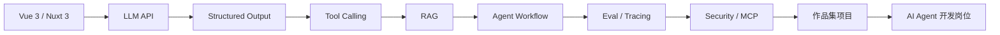

# AI Agent 开发学习路线细化版（Vue 前端工程师方向）

这套文档基于你已有的资深 Vue 前端经验设计，目标不是转成算法工程师，而是转向：

> Vue / 全栈工程师 -> LLM 应用工程师 -> AI Agent 开发工程师 -> Agent 产品 / 平台工程师

## 如何使用这套文档

建议按顺序学习，不要一开始就追框架：

1. 先理解 LLM API、结构化输出和工具调用
2. 再做 RAG，让 Agent 能基于资料回答问题
3. 然后接入业务工具，让 Agent 能执行任务
4. 再学习多步骤工作流、状态管理和人工确认
5. 最后补齐评测、安全、权限、MCP 和生产化

## 文档目录

- [00-总览与学习节奏.md](./00-总览与学习节奏.md)
- [01-LLM与Agent基础.md](./01-LLM与Agent基础.md)
- [02-RAG知识库Agent.md](./02-RAG知识库Agent.md)
- [03-工具调用与业务系统集成.md](./03-工具调用与业务系统集成.md)
- [04-Agent工作流与多步骤任务.md](./04-Agent工作流与多步骤任务.md)
- [05-评测Tracing与质量工程.md](./05-评测Tracing与质量工程.md)
- [06-安全权限MCP与生产化.md](./06-安全权限MCP与生产化.md)
- [07-Vue方向作品集项目.md](./07-Vue方向作品集项目.md)
- [08-学习资源索引.md](./08-学习资源索引.md)
- [09-术语表.md](./09-术语表.md)

## 推荐主线

## 核心原则

- 不要只做聊天框，要做可执行、可观察、可控的 Agent 产品
- 不要迷信多 Agent，先把单 Agent 的工具调用和状态管理做好
- 不要只调 prompt，要建立 eval、tracing 和失败案例库
- 不要让模型直接拥有高危权限，系统必须负责权限、审计和确认
- Vue 经验是优势，Agent 产品非常依赖复杂交互、状态展示和人机协作体验

