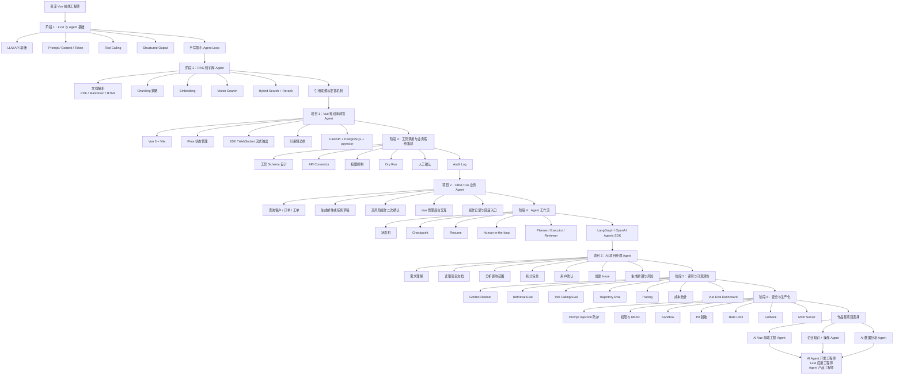
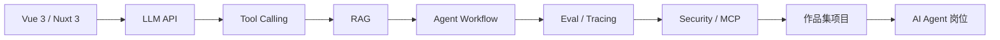

# AI Agent 开发学习路线流程图（Vue 方向）

```mermaid
flowchart TD
    A[资深 Vue 前端工程师] --> B[阶段 1：LLM 与 Agent 基础]

    B --> B1[LLM API 基础]
    B --> B2[Prompt / Context / Token]
    B --> B3[Tool Calling]
    B --> B4[Structured Output]
    B --> B5[手写最小 Agent Loop]

    B5 --> C[阶段 2：RAG 知识库 Agent]

    C --> C1[文档解析<br/>PDF / Markdown / HTML]
    C --> C2[Chunking 策略]
    C --> C3[Embedding]
    C --> C4[Vector Search]
    C --> C5[Hybrid Search + Rerank]
    C --> C6[引用来源与拒答机制]

    C6 --> D[项目 1：Vue 知识库问答 Agent]

    D --> D1[Vue 3 + Vite]
    D --> D2[Pinia 状态管理]
    D --> D3[SSE / WebSocket 流式输出]
    D --> D4[引用侧边栏]
    D --> D5[FastAPI + PostgreSQL + pgvector]

    D --> E[阶段 3：工具调用与业务系统集成]

    E --> E1[工具 Schema 设计]
    E --> E2[API Connector]
    E --> E3[权限控制]
    E --> E4[Dry Run]
    E --> E5[人工确认]
    E --> E6[Audit Log]

    E6 --> F[项目 2：CRM / OA 业务 Agent]

    F --> F1[查询客户 / 订单 / 工单]
    F --> F2[生成邮件或任务草稿]
    F --> F3[高风险操作二次确认]
    F --> F4[Vue 管理后台交互]
    F --> F5[操作记录与回滚入口]

    F --> G[阶段 4：Agent 工作流]

    G --> G1[状态机]
    G --> G2[Checkpoint]
    G --> G3[Resume]
    G --> G4[Human-in-the-loop]
    G --> G5[Planner / Executor / Reviewer]
    G --> G6[LangGraph / OpenAI Agents SDK]

    G6 --> H[项目 3：AI 项目经理 Agent]

    H --> H1[需求理解]
    H --> H2[读取项目文档]
    H --> H3[分析影响范围]
    H --> H4[拆分任务]
    H --> H5[用户确认]
    H --> H6[创建 Issue]
    H --> H7[生成排期与风险]

    H --> I[阶段 5：评测与可观测性]

    I --> I1[Golden Dataset]
    I --> I2[Retrieval Eval]
    I --> I3[Tool Calling Eval]
    I --> I4[Trajectory Eval]
    I --> I5[Tracing]
    I --> I6[成本统计]
    I --> I7[Vue Eval Dashboard]

    I --> J[阶段 6：安全与生产化]

    J --> J1[Prompt Injection 防护]
    J --> J2[权限与 RBAC]
    J --> J3[Sandbox]
    J --> J4[PII 脱敏]
    J --> J5[Rate Limit]
    J --> J6[Fallback]
    J --> J7[MCP Server]

    J --> K[作品集项目选择]

    K --> K1[AI Vue 前端工程 Agent]
    K --> K2[企业知识 + 操作 Agent]
    K --> K3[AI 数据分析 Agent]

    K1 --> L[目标岗位]
    K2 --> L
    K3 --> L

    L[AI Agent 开发工程师<br/>LLM 应用工程师<br/>Agent 产品工程师]
```

## 推荐主线

```mermaid
flowchart LR
    A[Vue 3 / Nuxt 3] --> B[LLM API]
    B --> C[Tool Calling]
    C --> D[RAG]
    D --> E[Agent Workflow]
    E --> F[Eval / Tracing]
    F --> G[Security / MCP]
    G --> H[作品集项目]
    H --> I[AI Agent 岗位]
```

