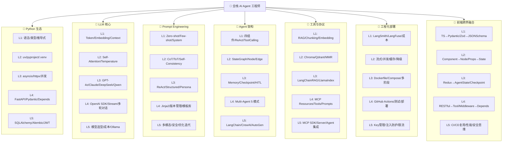

# 🌳 AI Agent 技能树图谱

> **全栈 AI Agent 工程师技能树** — 从基础到精通（L1→L5）
> **起始职业**：资深前端工程师 | **终极职业**：全栈 AI Agent 工程师

> 💡 **渲染说明**：以下 Mermaid flowchart 可在 GitHub / GitLab / VS Code（安装 Mermaid 扩展）中正常渲染。若你所用的 Markdown 渲染器不支持 Mermaid，请直接参考下方的纯文本表格版本。

---

## 🗺️ 技能树总览（Mermaid Flowchart）



---

## 📋 技能树总览（纯文本表格 — 100% 兼容）

| 技能树 | L1 基础 | L2 初级 | L3 中级 | L4 进阶 | L5 精通 |
|--------|---------|---------|---------|---------|---------|
| 🌿 **Python 生态** | 语法 · 类型注解 · 推导式 | uv · pyproject · .venv | asyncio · httpx · 并发 | FastAPI · Pydantic · Depends | SQLAlchemy · Alembic · JWT |
| 🧠 **LLM 核心** | Token · Embedding · Context | Self-Attention · Temperature | GPT-4o · Claude · DeepSeek · Qwen | OpenAI SDK · Stream · 多轮 | 模型选型 · 成本 · Ollama |
| 💬 **Prompt Engineering** | Zero-shot · Few-shot · System | CoT · ToT · Self-Consistency | ReAct · Structured · Persona | Jinja2 · 版本管理 · 模板库 | 多模态 · 安全 · 优化迭代 |
| 🤖 **Agent 架构** | 四组件 · ReAct · ToolCalling | StateGraph · Node · Edge | Memory · Checkpoint · HITL | Multi-Agent 5 模式 | LangChain · CrewAI · AutoGen |
| 🔧 **工具与协议** | RAG · Chunking · Embedding | Chroma · Qdrant · MMR | LangChainRAG · LlamaIndex | MCP Resources · Tools · Prompts | MCP SDK · Server · Agent集成 |
| 🚀 **工程化部署** | LangSmith · LangFuse · 成本 | 流式 · 并发 · 缓存 · 降级 | Dockerfile · Compose · 多阶段 | GitHub Actions · 测试 · 部署 | Key管理 · 注入防护 · 限流 |
| 🎨 **前端跨界融合** | TS→Pydantic · Zod→JSONSchema | Component→Node · Props→State | Redux→AgentState · Checkpoint | RESTful→Tool · Middleware→Depends | CI/CD复用 · 性能 · 安全思维 |

---

## 🌳 ASCII 技能树（紧凑版）

```
🎯 全栈 AI Agent 工程师 L5
│
├─ 🌿 Python 生态 ─────────────
│   L5: SQLAlchemy · Alembic · JWT
│   L4: FastAPI · Pydantic · Depends
│   L3: asyncio · httpx · 并发
│   L2: uv · pyproject · .venv
│   L1: 语法 · 类型注解 · 推导式
│
├─ 🧠 LLM 核心 ────────────────
│   L5: 模型选型 · 成本 · Ollama
│   L4: OpenAI SDK · Stream · 多轮
│   L3: GPT-4o · Claude · DeepSeek · Qwen
│   L2: Self-Attention · Temperature
│   L1: Token · Embedding · Context Window
│
├─ 💬 Prompt Engineering ─────
│   L5: 多模态 · Prompt 安全 · 优化迭代
│   L4: Jinja2 · 版本管理 · 模板库
│   L3: ReAct · Structured Output · Persona
│   L2: CoT · ToT · Self-Consistency
│   L1: Zero-shot · Few-shot · System Prompt
│
├─ 🤖 Agent 架构 ─────────────
│   L5: LangChain · CrewAI · AutoGen
│   L4: Router→Specialist · Sequential · Debate · Parallel
│   L3: Buffer · Summary · Checkpoint · HITL
│   L2: StateGraph · Node/Edge · Conditional Edge
│   L1: 核心四组件 · ReAct · Tool/Function Calling
│
├─ 🔧 工具与协议 ─────────────
│   L5: Python MCP SDK · Server 开发 · Agent 集成
│   L4: Resources · Tools · Prompts 原语
│   L3: LangChain RAG · LlamaIndex · 来源引用
│   L2: Chroma · Qdrant/Milvus · MMR 检索
│   L1: 文档加载切分 · Embedding · 相似度检索
│
├─ 🚀 工程化部署 ─────────────
│   L5: API Key · 注入防护 · 速率限制 · 健康检查
│   L4: GitHub Actions · 自动化测试 · 自动部署
│   L3: Dockerfile · Docker Compose · 多阶段构建
│   L2: 流式优化 · 并发优化 · Prompt 缓存 · 降级
│   L1: LangSmith · LangFuse · Token 成本分析
│
└─ 🎨 前端跨界融合 ───────────
    L5: CI/CD 复用 · 性能优化 · 安全防护 · 产品思维
    L4: RESTful→Tool · Middleware→Depends · Router→意图路由
    L3: Redux→AgentState · Pinia→StateGraph · Persist→Checkpoint
    L2: Component→Node · Props→State · TS→Pydantic 映射
    L1: 类型思维迁移 · 组件思维 · API 设计经验
```

---

## 🔗 技能依赖关系

```
═══════════════════════════════════════════════════════════════════════
                        技能依赖关系图 (→ 表示前置知识)
═══════════════════════════════════════════════════════════════════════

🌿 Python 生态 依赖链：
  Python 语法 → uv 包管理 → FastAPI 框架 → SQLAlchemy ORM
                             ↓               ↓
                        Pydantic 模型    Alembic 迁移
                             ↓               ↓
                        Depends 注入     JWT 认证

🧠 LLM 核心 依赖链：
  LLM 概念(→)Embedding(→)Transformer(→)API 调用(→)模型选型/成本分析
      │                                    │
      └─ Token 概念 ───────────────────────┘

💬 Prompt Engineering 依赖链：
  Zero-shot → Few-shot → CoT → ToT → ReAct → Structured Output
                                           ↓
                                    Persona / Jinja2

🤖 Agent 架构 依赖链：
  Agent 概念 → Tool Calling → ReAct → LangGraph → Memory → Multi-Agent
       ↑            ↑                               ↑
       └── LLM 核心 ┘                               │
       └── Prompt Engineering ──────────────────────┘

🔧 工具与协议 依赖链：
  RAG 概念 → Chunking → Embedding → Chroma → LangChain RAG → MCP 协议
                                         ↑
                                  LlamaIndex ─┘

🚀 工程化部署 依赖链：
  可观测性 → 性能优化 → Docker → CI/CD → 安全加固
      ↑                      ↑
      └── Agent 架构 ────────┘

🎨 前端跨界融合 依赖链（横向贯穿）：
  TS 类型思维 ──→ Pydantic 建模
  Component 组件 ──→ Agent Node
  Redux/Pinia ──→ AgentState
  RESTful API ──→ Tool 定义
  CI/CD ──→ 工程化部署

═══════════════════════════════════════════════════════════════════════
```

---

## 📊 七大技能树详解

### 🌿 技能树一：Python 生态

| 等级 | 技能节点 | 内容 | 对应关卡 | 依赖 |
|------|---------|------|----------|------|
| **L1** | Python 语法 | 类型、控制流、函数、类、模块 | Level 1-1 | 前端 TS 经验 |
| **L1** | 类型注解 | `x: int`、`-> str`、mypy 检查 | Level 1-1 | TS 类型系统 |
| **L1** | 推导式 | 列表/字典/集合推导式、切片 | Level 1-1 | JS map/filter |
| **L2** | uv 包管理 | init/add/sync/run、pyproject.toml | Level 1-2 | npm/pnpm 经验 |
| **L2** | 虚拟环境 | .venv、隔离依赖 | Level 1-2 | node_modules |
| **L3** | asyncio | 协程、事件循环、并发模式 | Level 1-2 | JS async/await |
| **L3** | httpx | 异步 HTTP 客户端 | Level 1-2 | fetch/axios |
| **L4** | FastAPI | 路由、中间件、Swagger | Level 1-3 | Express/Koa |
| **L4** | Pydantic | BaseModel、Field 验证、嵌套模型 | Level 1-3 | TS interface + zod |
| **L4** | Depends | 依赖注入、JWT 认证 | Level 1-3 | Express middleware |
| **L5** | SQLAlchemy | ORM 声明式模型、关系、CRUD | Level 1-4 | Prisma/TypeORM |
| **L5** | Alembic | 数据库迁移、版本管理 | Level 1-4 | Prisma Migrate |
| **L5** | JWT 认证 | Token 签发/验证、密码哈希 | Level 1-4 | JWT 前端使用经验 |

---

### 🧠 技能树二：LLM 核心

| 等级 | 技能节点 | 内容 | 对应关卡 | 依赖 |
|------|---------|------|----------|------|
| **L1** | Token 概念 | 文本切分单位、Tokenizer | Level 2-1 | 字符串编码 |
| **L1** | Embedding | 高维向量映射、语义空间 | Level 2-1 | CSS 颜色值类比 |
| **L1** | Context Window | 上下文窗口限制 | Level 2-1 | LocalStorage 限制 |
| **L2** | Self-Attention | 注意力机制直觉理解 | Level 2-1 | CSS 优先级 |
| **L2** | Temperature | 输出随机性控制 | Level 2-1 | Math.random() |
| **L3** | 模型生态 | GPT-4o/Claude/Gemini/DeepSeek/Qwen | Level 2-1 | 技术选型经验 |
| **L4** | OpenAI SDK | chat.completions、流式输出 | Level 2-2 | API 调用经验 |
| **L4** | 多轮对话 | 消息历史管理、角色管理 | Level 2-2 | 聊天应用经验 |
| **L5** | 模型选型 | 任务-模型匹配、成本对比 | Level 2-3 | 架构决策 |
| **L5** | 本地模型 | Ollama 部署、本地推理 | (支线) | Docker 基础 |

---

### 💬 技能树三：Prompt Engineering

| 等级 | 技能节点 | 内容 | 对应关卡 | 依赖 |
|------|---------|------|----------|------|
| **L1** | Zero-shot | 无示例直接提问 | Level 3-1 | — |
| **L1** | Few-shot | 2-5 个示例引导格式 | Level 3-1 | — |
| **L1** | System Prompt | 设定 AI 角色和行为边界 | Level 3-1 | — |
| **L2** | CoT | 逐步推理链 | Level 3-1 | Few-shot |
| **L2** | ToT | 多路径探索+评估 | Level 3-1 | CoT |
| **L2** | Self-Consistency | 多次采样取共识 | Level 3-1 | Zero-shot |
| **L3** | ReAct | 思考+行动交替循环 | Level 3-1 | CoT |
| **L3** | Structured Output | JSON Schema 约束输出 | Level 3-1 | Few-shot |
| **L3** | Persona | 角色扮演 Prompt | Level 3-1 | System Prompt |
| **L4** | Jinja2 模板 | 可复用 Prompt 模板引擎 | Level 3-1 | Python 基础 |
| **L5** | Prompt 优化 | A/B 测试、迭代改进、安全 | (实践) | 全部 Prompt 技能 |

---

### 🤖 技能树四：Agent 架构

| 等级 | 技能节点 | 内容 | 对应关卡 | 依赖 |
|------|---------|------|----------|------|
| **L1** | Agent 概念 | LLM+Tool+Memory+Planning | Level 4-1 | LLM 核心 |
| **L1** | ReAct 循环 | Thought→Action→Observation | Level 4-1 | Prompt ReAct |
| **L1** | Tool Calling | Function Calling 定义与调用 | Level 4-1 | API 设计经验 |
| **L2** | StateGraph | 状态图定义、节点、边 | Level 4-2 | — |
| **L2** | Conditional Edge | 基于状态的条件路由 | Level 4-2 | VueRouter 经验 |
| **L3** | Buffer Memory | 短期记忆、消息窗口 | Level 4-3 | SessionStorage |
| **L3** | Summary Memory | 长期记忆、对话摘要 | Level 4-3 | — |
| **L3** | Checkpoint | 状态快照、断点恢复 | Level 4-3 | Redux Persist |
| **L3** | HITL | 人机协同、中断审批 | Level 4-3 | 确认对话框 |
| **L4** | Router→Specialist | 意图路由分发模式 | Level 4-4 | 前端路由 |
| **L4** | Sequential | 链式 Pipeline | Level 4-4 | Gulp/Webpack |
| **L4** | Debate/Review | 多方讨论评审模式 | Level 4-4 | Code Review |
| **L4** | Parallel+Merge | 并行处理汇总 | Level 4-4 | Promise.all |
| **L5** | CrewAI | 角色/任务/工具定义 | Level 4-4 | Multi-Agent |
| **L5** | AutoGen | 对话式多智能体 | Level 4-4 | Multi-Agent |

---

### 🔧 技能树五：工具与协议

| 等级 | 技能节点 | 内容 | 对应关卡 | 依赖 |
|------|---------|------|----------|------|
| **L1** | RAG 概念 | 检索增强生成完整流程 | Level 3-2 | LLM 核心 |
| **L1** | Chunking | 文档切分策略（5 种） | Level 3-2 | — |
| **L1** | Embedding | 文本向量化 | Level 3-2 | LLM Embedding |
| **L2** | Chroma | 嵌入式向量数据库 | Level 3-2 | — |
| **L2** | 相似度检索 | Cosine/Euclidean/Dot | Level 3-2 | — |
| **L2** | MMR 检索 | 最大边际相关性 | Level 3-2 | 相似度检索 |
| **L3** | LangChain RAG | RetrievalQA、来源引用 | Level 3-3 | Chroma |
| **L3** | LlamaIndex | VectorStoreIndex、QueryEngine | Level 3-3 | — |
| **L4** | MCP Resources | 数据资源暴露 | Level 5-1 | RESTful GET |
| **L4** | MCP Tools | 可执行操作 | Level 5-1 | RESTful POST |
| **L4** | MCP Prompts | Prompt 模板 | Level 5-1 | Jinja2 |
| **L5** | MCP Server 开发 | Python SDK、三原语实现 | Level 5-2 | MCP 协议 |
| **L5** | Agent 集成 MCP | ClientSession、Tool 转换 | Level 5-3 | LangGraph |

---

### 🚀 技能树六：工程化部署

| 等级 | 技能节点 | 内容 | 对应关卡 | 依赖 |
|------|---------|------|----------|------|
| **L1** | 可观测性概念 | Trace/Span、核心指标 | Level 6-1 | 前端监控经验 |
| **L1** | Token 计数 | tiktoken、成本估算 | Level 6-1 | — |
| **L2** | LangSmith | Trace 追踪、Feedback | Level 6-1 | — |
| **L2** | LangFuse | 开源方案、自托管 | Level 6-1 | — |
| **L2** | 流式优化 | 首字节延迟优化 | Level 6-2 | 前端 SSR 优化 |
| **L2** | Prompt 缓存 | 缓存命中、语义缓存 | Level 6-1 | HTTP 缓存 |
| **L3** | Dockerfile | 镜像构建、最佳实践 | Level 6-2 | 前端容器化经验 |
| **L3** | Docker Compose | 多服务编排 | Level 6-2 | — |
| **L3** | 多阶段构建 | 镜像体积优化 | Level 6-2 | — |
| **L4** | GitHub Actions | CI 工作流、自动化测试 | Level 6-2 | 前端 CI/CD |
| **L4** | 自动部署 | SSH 部署、CD 流水线 | Level 6-3 | — |
| **L5** | API Key 安全 | SecretStr、环境变量 | Level 6-3 | 前端 .env |
| **L5** | Prompt 注入防护 | 输入过滤、输出审查 | Level 6-3 | XSS 防护 |
| **L5** | 速率限制 | slowapi、频率控制 | Level 6-3 | 防抖节流 |
| **L5** | 健康检查 | /health、优雅关闭 | Level 6-3 | — |

---

### 🎨 技能树七：前端跨界融合

| 等级 | 技能节点 | 前端经验 | AI Agent 对应 | 迁移难度 |
|------|---------|----------|---------------|----------|
| **L1** | 类型思维 | TS interface/type | Pydantic BaseModel | ⭐ 极易 |
| **L1** | 组件思维 | React Component/Vue SFC | Agent Node | ⭐⭐ 容易 |
| **L1** | API 设计 | RESTful API 设计 | Tool 接口定义 | ⭐ 极易 |
| **L2** | 类型迁移 | Zod/yup 校验 | Pydantic Field 验证 | ⭐ 极易 |
| **L2** | 异步编程 | async/await/Promise | asyncio 协程 | ⭐ 极易 |
| **L2** | 虚拟 DOM | React Virtual DOM | Transformer 架构类比 | ⭐⭐⭐ 适中 |
| **L3** | 状态管理 | Redux/Pinia Store | AgentState/StateGraph | ⭐⭐ 容易 |
| **L3** | 状态持久化 | Redux Persist/Pinia Plugin | Checkpoint/MemorySaver | ⭐ 极易 |
| **L3** | 路由守卫 | beforeEach 导航守卫 | Conditional Edge 条件路由 | ⭐⭐ 容易 |
| **L4** | 中间件 | Express/Koa Middleware | FastAPI Depends | ⭐ 极易 |
| **L4** | 路由分发 | Vue Router/React Router | Agent Router 意图分发 | ⭐⭐ 容易 |
| **L4** | 组件通信 | props/emit/provide-inject | Multi-Agent 消息传递 | ⭐⭐ 容易 |
| **L5** | CI/CD | GitHub Actions 部署前端 | Agent 系统 CI/CD | ⭐ 极易 |
| **L5** | 性能优化 | Web Vitals/Lighthouse | Token 成本/延迟优化 | ⭐⭐ 容易 |
| **L5** | 安全防护 | XSS/CSP/Input 过滤 | Prompt 注入/输出安全 | ⭐⭐ 容易 |
| **L5** | 产品思维 | 用户体验设计 | Agent 交互流程设计 | ⭐⭐⭐ 独特优势 |

---

## 🎯 技能进阶路线图

```
                    ┌──────────────────────────────────────────┐
                    │          🎯 第 22 周：技能树完全点亮        │
                    └──────────────────────────────────────────┘
                                         │
        ┌────────┬────────┬───────┬──────┼──────┬────────┬────────┐
        ▼        ▼        ▼       ▼      ▼      ▼        ▼        ▼
    阶段一    阶段二    阶段三    阶段四    阶段五    阶段六    持续
    (L1-L5)  (L1-L5)  (L1-L5)  (L1-L5)  (L1-L5)  (L1-L5)    成长

    ┌─────────────────────────────────────────────────────────────┐
    │                     阶段一：第1-4周                           │
    │  🌿 Python L1→L5: 语法 → 工程化 → 异步 → FastAPI → SQLAlchemy│
    │  点亮节点: 12                                              │
    └─────────────────────────────────────────────────────────────┘
                              │
                              ▼
    ┌─────────────────────────────────────────────────────────────┐
    │                     阶段二：第5-7周                           │
    │  🧠 LLM核心 L1→L5: Token → Embedding → Transformer → API调用 │
    │  点亮节点: 10                                              │
    └─────────────────────────────────────────────────────────────┘
                              │
                              ▼
    ┌─────────────────────────────────────────────────────────────┐
    │                     阶段三：第8-11周                          │
    │  💬 Prompt L1→L5: Zero-shot → CoT → ReAct → Jinja2         │
    │  🔧 工具 L1→L3: RAG → Chunking → Chroma → LangChain/LlamaIdx│
    │  点亮节点: 12 + 8                                          │
    └─────────────────────────────────────────────────────────────┘
                              │
                              ▼
    ┌─────────────────────────────────────────────────────────────┐
    │                     阶段四：第12-16周                         │
    │  🤖 Agent L1→L5: 概念 → LangGraph → Memory → Multi-Agent    │
    │  点亮节点: 18 (最大技能树)                                    │
    └─────────────────────────────────────────────────────────────┘
                              │
                              ▼
    ┌─────────────────────────────────────────────────────────────┐
    │                     阶段五：第17-19周                         │
    │  🔧 工具 L4→L5: MCP 协议 → MCP Server 开发 → Agent 集成      │
    │  点亮节点: 8                                               │
    └─────────────────────────────────────────────────────────────┘
                              │
                              ▼
    ┌─────────────────────────────────────────────────────────────┐
    │                     阶段六：第20-22周                         │
    │  🚀 工程化 L1→L5: 可观测性 → Docker → CI/CD → 安全加固      │
    │  🎨 前端融合 L1→L5: (横向贯穿，随阶段逐步点亮)                │
    │  点亮节点: 14                                              │
    └─────────────────────────────────────────────────────────────┘
```

---

## 📈 技能点统计

| 技能树 | L1 | L2 | L3 | L4 | L5 | 总节点 |
|--------|----|----|----|----|----|--------|
| 🌿 Python 生态 | 3 | 2 | 2 | 3 | 3 | **13** |
| 🧠 LLM 核心 | 3 | 2 | 1 | 2 | 2 | **10** |
| 💬 Prompt Engineering | 3 | 3 | 3 | 1 | 1 | **11** |
| 🤖 Agent 架构 | 3 | 2 | 4 | 4 | 2 | **15** |
| 🔧 工具与协议 | 3 | 3 | 2 | 3 | 2 | **13** |
| 🚀 工程化部署 | 2 | 4 | 3 | 2 | 4 | **15** |
| 🎨 前端跨界融合 | 3 | 3 | 3 | 3 | 4 | **16** |
| **总计** | **20** | **19** | **18** | **18** | **18** | **93** |

---

> 🌟 **技能树即地图**：每点亮一个节点，你的全栈 AI Agent 工程能力就更进一步。
>
> 93 个技能节点分布在 7 棵技能树上，随着 22 周的学习逐步解锁。
> 前端跨界融合技能树会随着其他技能树的学习而自然点亮——因为你已经掌握了最核心的工程思维和产品感知力。
